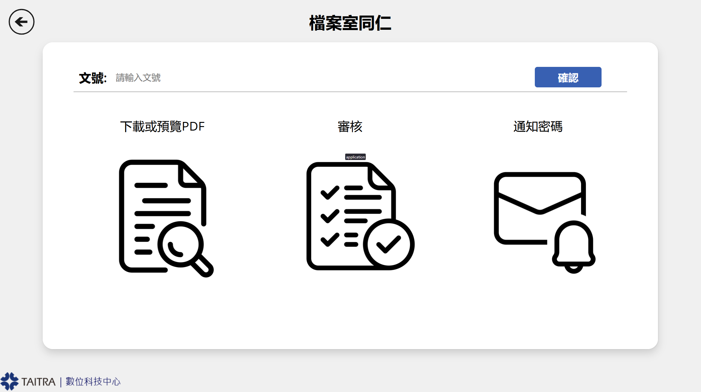

# DURA

## Project Overview
DURA is an internal document management system developed on Microsoft PowerPlatform (PowerApps, Power Automate, Dataverse). It facilitates the electronic scanning, uploading, categorization, and retrieval of documents to and from the company archives. Includes request management functionality for accessing stored documents.

The system provides:
- A centralized repository for all scanned company documents
- A streamlined request process for retrieving archived documents
- Access controls based on user roles and password protection for retrieving documents

## Key Features
- **Document Upload**: Intuitive interface for uploading scanned documents with metadata tagging.

- **Document Approval**: Simple and straightforward approval process for admins.

- **Search & Retrieval**: Powerful search capabilities across document content and metadata.

- **Document Request System**: Workflow for requesting access to archived documents.

- **Request Tracking**: Monitor status of document retrieval requests.

## Technical Implementation
DURA was developed using Microsoft's PowerPlatform suite:
- **PowerApps**: Provides user-friendly interfaces for document management workflows
- **Power Automate**: Handles document processing, approval flows, and notifications
- **Dataverse**: Stores document metadata, user permissions, and request information
